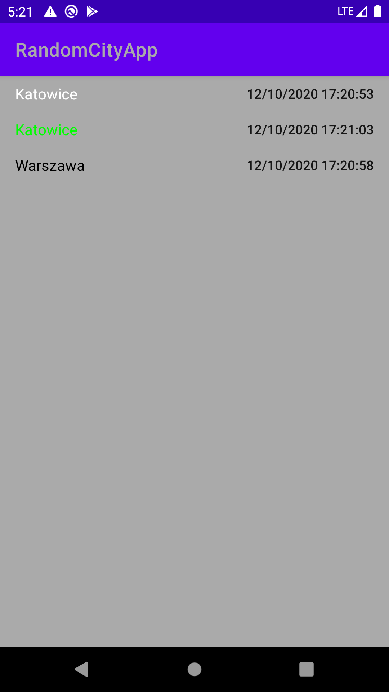
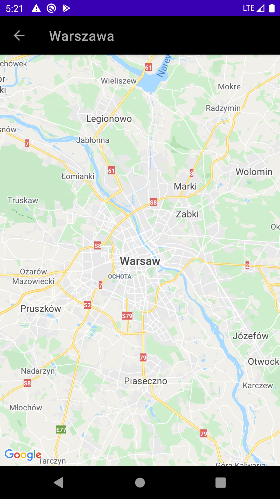

1. To implement the app I’ve decided to use RxJava. It is also possible to use Kotlin Coroutines for this type of functionality.
2. Google Maps API key needs to be added to have displayed maps in the app . To do that, create `secrets.properties` file in root directory of the project which contains `MAPS_API_KEY=here_insert_api_key`
3. Class implemented in Java is [CityDataDetailsFragment](https://github.com/michal-chojnacki/RandomCityApp/blob/main/app/src/main/java/com/github/michalchojnacki/randomcityapp/ui/citydatadetails/CityDataDetailsFragment.java)
4. I wrote some unit tests for the code, naturally production code should have more code covered with tests.
5. Screenshots:

|  |  |
:-------------------------:|:-------------------------:

6. If that was a production code it would also be worth it to setup CI environment and configure static code analysis.
7. I didn't do any branches during development, however tried to have friendly commits history. However normally I'm using branches ;)
8. Thanks for the review, I will be happy to hear your feedback :) 
